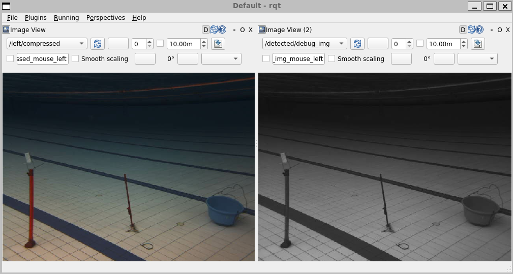

# Hornet X Software Assignment 3

This repository contains a ROS2 package called "assignment3". It includes a basic detector node.

Your task is to implement a node that draws a bounding box around key objects and label them appropriately.

You may publish detections in a single topic or multiple topics (each topic for dedicated object).

Objects in bag:
1. Red Drum
2. Red Flare
3. Orange Flare
4. Gate
5. Blue Drum

Refer to the third workshop for more details.

> [!IMPORTANT]  
>Assignment 3 not required to submit through email. You may present your work during your interview!
> 
>Optional: Zip and email your solution to hornetxauv2425@gmail.com with subject "[Software Homework 3] \<Name\>".

## Playing ROS2 bags

For this assignment you will have to make use of a ROS2 bag recording from a previou year.
The ROS2 bag files can be downloaded [here](https://drive.google.com/file/d/1Rtj0bMxOneBKzOfB2BrAZpJGxKcIMcY9/view?usp=drive_link)

Simply untar and play the bag file

```bash
tar -xvf session3bags.tar
ros2 bag play session3bags
```

This should start publishing ROS2 CompressedImage messages to the `/left/compressed` topic,
which you can verify by running thr `ros2 topic list` command.

## Setting up the assignment

If you have followed the set up instructions from the workshop,
you should have all the dependencies (mainly OpenCV) installed and ready to go.

To run the default code, first ensure that you have `session3bags` playing.
Then, in a seperate terminal add this package to your workspace and build

```bash
colcon build --packages-select assignment3
source install/setup.bash
ros2 run assignment3 detector
```

The default code publishes a gray scaled version of the images from the `session3bags` to the `/detected/debug_img` topic.

If you are using RQT to visualise your images,
you should be able to display the gray scaled version of the images like so



Note the original image from the bag file is on the left, and the published image is on the right.
